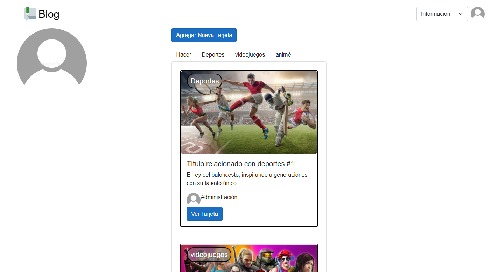
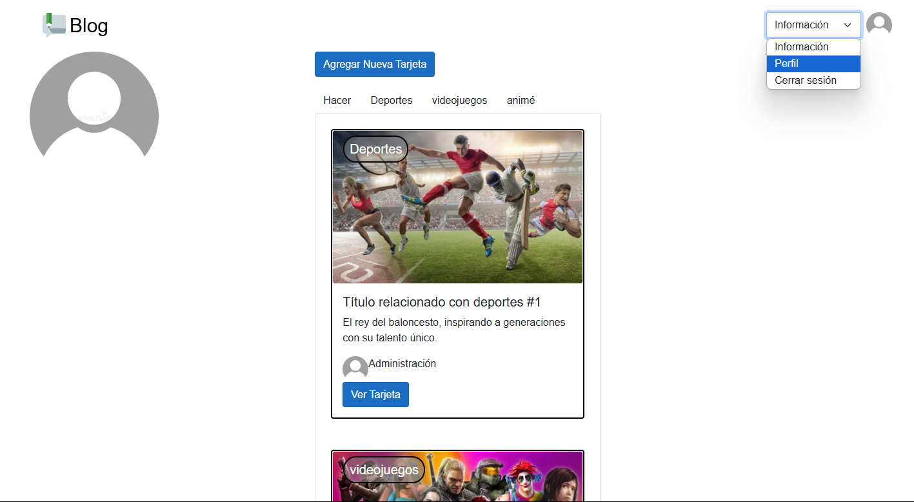
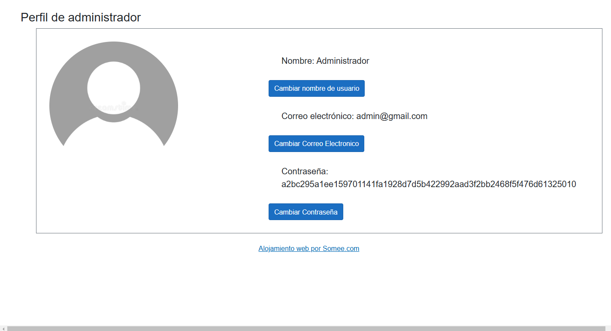
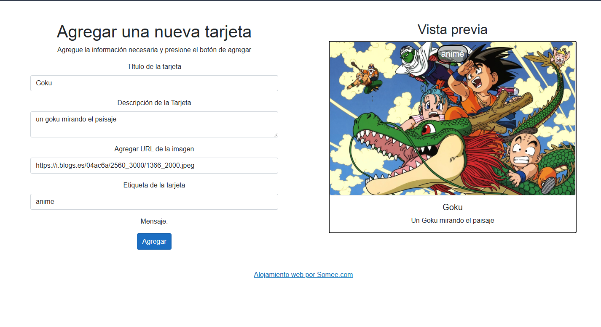

# Proyecto de Blog

#### Este proyecto fue realizado con Blazor y C#, este es un proyecto desarollado con las siguientes tecnologias:

* C#
* Blazor
* HTML
* Boostrap
* CSS
* MySQL

#### Este proyecto fue realizado con la arquitectura Model-Viwe-Controller y se tomo en cuenta la reutilizacion de componentes y el clean code

## Inicio del Blog

#### Este es el inicio, con ello puedes iniciar sesion, crear una cuenta y mirar las tarjetas agregadas por otras personas

## Iniciar Sesion

#### puedes iniciar sesion con tus datos

## Crear Cuenta

#### al igual que puedes crearte una cuenta con correo gmail  (este no sera autenticado)

## Sesion Iniciada

Esta es la interfaz con los datos del inicio de sesion

## Mirar Perfil

#### Uno puede Mirar los datos del inicio de sesion en el apartado 'Perfil' en informacion

## Agregar Tarjeta

#### Puedes agregar tus tarjetas pasando unicamente:

- el nombre de la tarjeta
- la descripcion
- la url (que representa la imagen)
- y el tipo que puede ser de los siguientes:
   * deportes
   * anime
   * videojuegos
